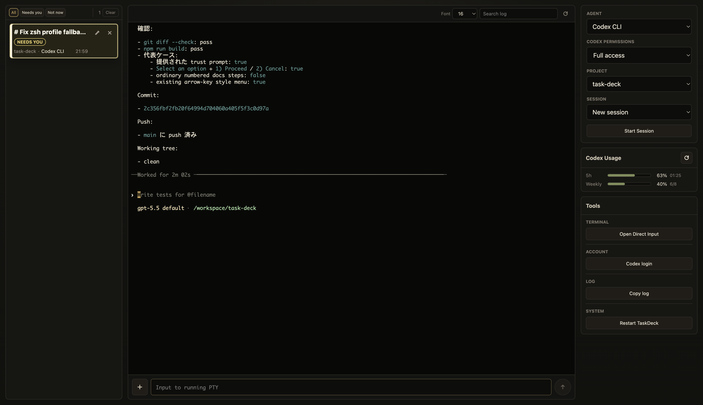

# TaskDeck

TaskDeck is a local supervision UI for running and monitoring AI agent tasks. On this branch the only committed task launch route is Codex App Server, started directly in the TaskDeck server environment with stdio JSON. TaskDeck supervises structured turns, command output, and user-input requests without treating a TUI transcript as the control protocol.



## Prerequisites

- Node.js 20 and npm 10, pinned for this repository by Volta (`node` 20.20.2 and `npm` 10.9.8)
- Codex CLI available in the same environment that runs the TaskDeck server
- A local workspace where agent commands may safely read, edit, and run files

TaskDeck is intended for local use. Do not expose the server to a LAN or the internet without separate authentication, network controls, and operational protection.

Verify the Node/npm toolchain from a normal host terminal before installing dependencies:

```bash
node -v
npm -v
```

Do not use a TaskDeck-managed task for this check. Those tasks may inherit npm lifecycle environment from `dev-supervisor`, and local tools such as nodenv or `~/.node-version` can pollute the runtime they see.

## Install

```bash
npm ci
```

## Run

```bash
npm run dev
```

Then open:

```text
http://localhost:3000
```

The dev command runs the local Node server and mounts Vite middleware for the React UI. Server-side code changes require restarting `npm run dev`.

## First Task

1. Use the default `Codex App Server` launch form in the right rail.
2. Choose a project/workspace.
3. Start the task.
4. Send instructions from the composer attached to the task log.

Task cards in the left rail show the active tasks and their supervision state. The center pane shows the selected task's live output and persisted log view. For Codex App Server tasks, TaskDeck renders structured App Server messages as human-readable task output, handles user-input requests through the UI, and exposes model and reasoning-effort selectors in the composer. Selector changes apply to the next instruction and later turns.

## Configure Projects

Fresh clones may show only the TaskDeck repository in the Project dropdown. To point TaskDeck at your own project folder list, create the ignored local config:

```bash
cp taskdeck.local.example.json taskdeck.local.json
```

Then edit `taskdeck.local.json`:

```json
{
  "projectRoot": "/Users/you/Projects",
  "defaultModel": "gpt-5.5",
  "codexAppServer": {
    "loginMethod": "deviceCode"
  }
}
```

`projectRoot` is a parent directory whose immediate child directories become Project choices. `defaultModel` is optional; when set, TaskDeck passes it to Codex App Server for each new thread. Without it, Codex uses its own configured default. Once App Server is initialized, TaskDeck loads the available model catalog for the composer selector. `taskdeck.local.json` is ignored by Git and is the right place for machine-local paths and model defaults.

`codexAppServer.loginMethod` controls how TaskDeck asks Codex App Server to start ChatGPT login when no valid cached session is available. The default is `deviceCode`, which preserves the existing verification URL plus user-code flow. Set it to `browserRedirect` to have App Server return a ChatGPT login URL that you open directly in a browser. The resulting Codex login is still cached in the same environment that runs the `codex-app-server` profile command.

## Configure Agent Profiles

TaskDeck ships one committed launch profile on this branch:

```text
codex --sandbox danger-full-access --ask-for-approval never app-server --listen stdio://
```

That command runs directly in the TaskDeck server environment. Do not assume TaskDeck will start or enter a separate Docker container. If a local machine needs a wrapper, put that override in ignored local config; do not treat the wrapper as the product route for this branch.

Keep normal fresh-clone project setup minimal by putting `projectRoot` and, when needed, `defaultModel` in `taskdeck.local.json`. If you need a machine-local launch wrapper, override the `codex-app-server` profile in `taskdeck.local.json`, copy `taskdeck.profiles.example.json` into another ignored local config file, or point `TASKDECK_CONFIG` at another config file. Additional profile ids are ignored by the current App Server-only launch surface.

For example:

```bash
TASKDECK_CONFIG=/path/to/taskdeck.profiles.json npm run dev
```

The committed App Server route uses `danger-full-access` and `--ask-for-approval never` in the TaskDeck server environment. TaskDeck also passes full-access/no-approval overrides to App Server `thread/start` and `turn/start`. TaskDeck does not otherwise synthesize Codex CLI/TUI reasoning, startup, or resume flags for this profile. The committed route intentionally avoids interactive Codex CLI access; custom local profiles are outside the product route for this branch.

Agent profiles merge by `id`: built-in defaults load first, then committed config, ignored local config, and finally `TASKDECK_CONFIG`.

## Decision Gateway

TaskDeck can send a manual one-way decision request to Decision Gateway from a task card. Configure the gateway URL before starting TaskDeck:

```bash
PORT=3001 DECISION_GATEWAY_URL=http://localhost:3000 npm run dev
```

The `PORT=3001` example keeps TaskDeck from colliding with a local Decision Gateway dev server running on `localhost:3000`. If Decision Gateway is running elsewhere, set `DECISION_GATEWAY_URL` to that base URL.

When configured, use **Ask for decision** on a task card. TaskDeck sends source context and a bounded redacted recent-output snippet to `POST /api/decision-requests` on Decision Gateway, then shows the returned Decision Workspace URL.

This is only a source connector. TaskDeck does not generate the Decision Workspace UI, poll for results, resume agents, or deliver decisions back.

## Branch Worktree Lifecycle

TaskDeck branch work uses `git worktree`. Use the main repository as the base development checkout and create one worktree per branch and purpose.

Remote GitHub branches are the durable source of truth. A branch task is complete only after intended changes are committed and pushed.

See [Branch worktree lifecycle](docs/branch-worktree-lifecycle.md) for the standard setup, handoff, recovery, and cleanup workflow.

## Local Data

TaskDeck stores runtime data under `.taskdeck/`, including task records, persisted logs, session labels, presets, and attachments. This directory is intentionally ignored by Git and may contain sensitive agent output.

TaskDeck also starts local manager action transports and records them in `.taskdeck/run/manager-actions.json`. The preferred transport is the Unix socket at `.taskdeck/run/manager-actions.sock`; a token-protected loopback TCP fallback is advertised for manager sessions running inside Docker containers where a mounted macOS host socket is visible but not connectable. Manager sessions use `taskdeckctl ack`, `taskdeckctl review`, and `taskdeckctl close`; the server validates, logs under `.taskdeck/manager-actions/`, mutates, and broadcasts the result.

## Safety Notes

TaskDeck can launch local agent processes that may edit files and run commands. Docker/container wrapping, when locally configured, is containment, not a complete security boundary. Use full-access agent operation only in a safe or disposable workspace.

## More Documentation

- [Architecture map](docs/architecture.md)
- [Local API reference](docs/api.md)
- [Actor protocol and manager control plane](docs/taskdeck-actor-protocol.md)
- [Branch worktree lifecycle](docs/branch-worktree-lifecycle.md)
- [Current work plan](docs/current-work-plan.md)
- [Session identity card experiment](docs/issues/0015-session-identity-first-cards.md)
