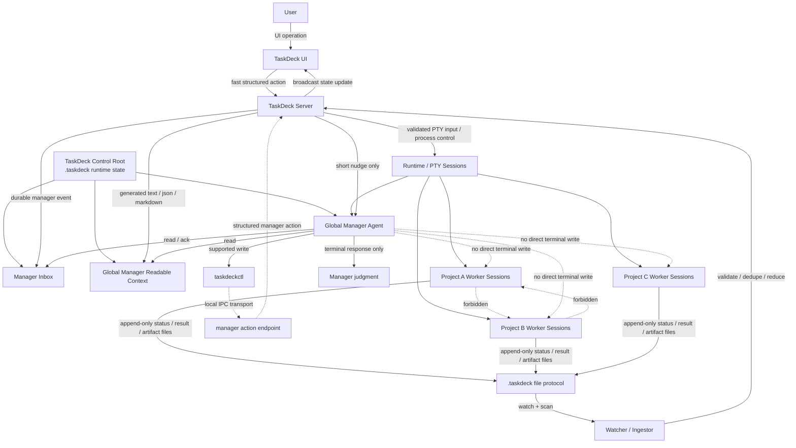

# TaskDeck Actor Protocol Model

This document records the current actor boundary and near-term manager control-plane direction for TaskDeck.

GitHub Issues remain the source of truth for actionable work and completion state. This document is durable design guidance for how TaskDeck actors are allowed to communicate.

## Repository isolation for AI-assisted development

Do not use `git worktree` for TaskDeck AI-assisted development. Isolated work must use a full clone.

Worktree directories are not self-contained because their `.git` file points back to the parent repository's `.git/worktrees` metadata. That indirection is unsafe across macOS, Docker, `/workspace` paths, copied directories, and AI agents.

Recommended local layout:

```text
~/Documents/task-deck                 stable/main clone
~/Documents/task-deck-manager-write   feature clone
```

Keep development isolation through separate clone path, branch, and `PORT`.

For current manager write verification:

```text
branch: feature/manager-write-path
clone path: /Users/hayashikentarou/Documents/task-deck-manager-write
port: 3001
```

## Core principle

TaskDeck should separate agent-readable communication from state mutation.

Non-manager AI agents should not directly mutate TaskDeck state and should not send commands directly to other agents. They produce append-only file outputs. The manager reads those outputs and decides what should happen next. The manager also does not directly control worker agents; it calls a constrained TaskDeck command interface, and TaskDeck server performs the actual validated mutation.

The read loop has been proven first; the current implementation routes the minimum manager write path through `taskdeckctl`.

```text
Workers write files.
Manager reads files first.
Manager calls taskdeckctl for supported writes.
Server mutates state.
```

## Actor diagram



## Actors

### Worker agents

Worker agents include ordinary Codex, Goose, shell, or future provider sessions that are not the dedicated manager.

Worker agents are project-bound. They are launched in a selected project workspace and perform actual work inside that project scope.

They may read:

```text
- generated task context
- assigned instructions
- readable task views
- their own environment variables
```

They may write:

```text
- append-only status files
- append-only result or artifact files
- their own notes
- bounded request files when the protocol explicitly allows them
```

They must not:

```text
- mutate canonical TaskDeck state
- write another agent's status
- send commands directly to another agent
- call manager-action commands
- write raw PTY input to another session
- smuggle raw commands, env, secrets, or auto-approval fields through request files
```

### Global Manager Agent

The global manager agent is a TaskDeck-level supervisor. It must be launched from the TaskDeck control/document root, not from an individual project workspace or Project dropdown selection.

The manager reads TaskDeck-generated files and manager inbox events across all supervised projects, then decides what action should happen next.

It may read:

```text
- file change notifications
- global manager inbox
- global generated readable views across projects
- action results returned by TaskDeck after `taskdeckctl` actions
```

The read-loop MVP used terminal response only for manager judgment. In the current minimum write path, the manager may call `taskdeckctl ack`, `taskdeckctl review`, and `taskdeckctl close` for supported actions. It must not write judgment/status files, including `TASKDECK_STATUS_FILE`.

Manager write operations go through:

```text
taskdeckctl
```

The manager must not directly mutate TaskDeck state or directly write into worker terminals.

It is not a worker inside Project A, Project B, or Project C. Worker sessions remain project-bound; the manager session remains TaskDeck control/document-root-bound.

### TaskDeck server

TaskDeck server owns mutation and delivery.

It is responsible for:

```text
- validation
- dedupe
- projection
- action execution
- action logging
- PTY input delivery
- UI broadcast
```

### User/UI

The UI uses a fast structured action path because user-facing actions should be responsive. UI operations should not be routed through the manager inbox.

## Protocol decisions

### Manager read path

Manager reads are file-based.

```text
App/Server
  -> global manager inbox / global readable projection files
  -> file change notification / short nudge
  -> Manager reads files
```

The manager reads durable context from files. A nudge is only a wake-up signal and is not the source of truth.

The read loop is the first behavior to prove with a real manager session:

```text
worker status
  -> server emits global manager event / global readable context
  -> global manager receives short nudge
  -> global manager reads files
  -> global manager reports its judgment in the terminal response only
```

The read-loop MVP should prove that worker status from any project can flow into global manager inbox/context, be read by the global manager, and produce manager judgment in the terminal response only.

Current read-loop MVP files:

```text
.taskdeck/manager-inbox/<eventId>.json
.taskdeck/manager-readable/context.md
.taskdeck/manager-readable/unread-events.json
```

The dedicated manager session is started from the TaskDeck control/document root. TaskDeck marks that task as a manager session and provides environment variables that point to the actual TaskDeck runtime `dataRoot` files, not paths relative to the manager cwd:

```text
TASKDECK_MANAGER_ROLE=manager
TASKDECK_MANAGER_INBOX_DIR
TASKDECK_MANAGER_READABLE_DIR
TASKDECK_MANAGER_CONTEXT_FILE
TASKDECK_MANAGER_UNREAD_EVENTS_FILE
TASKDECK_STATUS_FILE
```

When a new unread manager event is created, TaskDeck sends only a short nudge to running manager sessions. The nudge is a wake-up signal; the durable source of truth remains the manager inbox and manager-readable files.

For the completed read-loop MVP, the manager reported judgment in the terminal response only. In the current minimum write path, it may call `taskdeckctl` for supported manager actions, but it must not write `TASKDECK_STATUS_FILE`, command workers directly, mutate TaskDeck state directly, or behave as if it is scoped to one selected project.

### Manager write path

Manager writes go through `taskdeckctl`. The first implemented vertical slice supports acknowledgement, review marking, and task closing only.

```text
Manager
  -> taskdeckctl ack/review/close
  -> local IPC endpoint
  -> TaskDeck server
  -> validation / dedupe / action log
  -> acknowledgement mutation
```

The preferred local IPC endpoint is a Unix domain socket, not an exposed Web API.

```text
.taskdeck/run/manager-actions.sock
```

The server records the active transports in `.taskdeck/run/manager-actions.json`; this lets `taskdeckctl` follow a fallback socket path if the local filesystem leaves an undeletable stale socket entry. It also advertises a token-protected loopback TCP fallback for Docker manager sessions where a macOS host Unix socket can be mounted as a file but cannot be used as a Linux Unix socket endpoint.

This avoids opening a network API surface while still avoiding the roundabout manager-action-file path for commands.

Current supported command:

```sh
taskdeckctl ack --event <eventId>
taskdeckctl ack --task <taskId>
taskdeckctl review --task <taskId>
taskdeckctl close --task <taskId>
```

`taskdeckctl ack --event` writes the manager event `.ack.json` sidecar through the server, refreshes the generated manager-readable files, acknowledges the target task attention state when applicable, logs the manager action under `.taskdeck/manager-actions/`, and broadcasts the updated task snapshot. Repeated `actionId` values are deduped by the server process, and events that already have an ack sidecar return a successful already-acknowledged result.

`taskdeckctl review --task` marks a task as reviewed and clears review-ready attention when applicable. `taskdeckctl close --task` marks a task closed, stops any active PTY process for that task, preserves the task record/logs for history, and removes it from the running task set. Both commands are idempotent when the target task is already reviewed or closed.

Every manager action result is written as a per-action JSON file under `.taskdeck/manager-actions/`. A compact recent history is also available at `.taskdeck/manager-actions/history.json`.

### Why not raw Web API as the manager-facing surface

Raw Web API is not the preferred manager-facing protocol because it exposes too much operational complexity to the AI agent:

```text
- API base URL
- token / auth header
- HTTP method
- JSON body escaping
- response parsing
- HTTP error interpretation
- Docker localhost confusion
```

If HTTP is used later, it should be hidden behind `taskdeckctl`. The current container fallback is not HTTP; it is the same newline-delimited manager action protocol over a loopback TCP listener with a per-server-run token from `.taskdeck/run/manager-actions.json`.

### Why not manager-action files as the primary write path

Append-only files remain useful for worker outputs and manager-readable events.

However, for manager write operations, a file request flow can be unnecessarily indirect:

```text
Manager
  -> write action file
  -> watcher
  -> server
  -> result file
  -> manager reads result
```

Since the manager does not need UI-level latency but does need reliable command semantics, a local IPC command endpoint gives a cleaner command path while keeping mutation inside the server.

## Future manager write flow

```text
Manager Agent
  -> taskdeckctl send-task-input --target-task <taskId> --message <message>
  -> Unix domain socket
  -> TaskDeck server action executor
  -> validate actor / action / target
  -> write action log
  -> deliver PTY input to target session
  -> return result
```

Example:

```sh
taskdeckctl send-task-input \
  --target-task task_child_001 \
  --message "前回の報告では原因が曖昧です。失敗原因を1つに絞って、根拠を status に出してください。"
```

## Server-side requirements for future write support

The server must treat manager commands as structured actions, not raw terminal access.

Required safeguards:

```text
- manager-only capability
- single manager action executor
- allowlisted action types
- actorTaskId validation
- targetTaskId validation
- actionId dedupe
- action log
- clear success/failure result
```

Allowed action types:

```text
acknowledgeManagerEvent
markTaskReviewed
closeTask
```

Forbidden operations:

```text
rawTerminalWrite
rawSql
arbitraryTaskUpdate
writeOtherAgentStatus
deleteLogs
debugStateMutation
```

## Capability boundary

The local IPC endpoint should only be visible to the manager process/session.

Desired structural boundary:

```text
Manager:
  can see .taskdeck/run/manager-actions.json
  can use the advertised manager action transport
  can execute taskdeckctl

Worker:
  cannot see manager-actions.json or manager-actions.sock
  cannot execute manager action commands
```

If running in containers, mount the manager action pointer and runtime directory only into the manager environment. Docker Desktop on macOS may show the host Unix socket file inside the Linux container while still failing to connect to it; `taskdeckctl` should then fall back to the token-protected TCP transport advertised by the pointer file.

The minimum manager write path uses these server-owned transports for ack, review, and close actions; future manager write support should preserve the same boundary.

## MVP implementation sequence

### Phase 1: Document protocol boundary

Add and maintain this actor protocol document. Reference it from `AGENTS.md` so future agents do not collapse worker, manager, and server responsibilities.

### Phase 2: Validate manager inbox MVP

Use an isolated QA branch in a full clone to verify that child status changes emit valid manager inbox events.

### Phase 3: Add a dedicated manager agent profile/session

Introduce a way to run a global manager session whose job is to read manager inbox events and generated readable context across all projects.

The first implementation uses a built-in `TaskDeck Manager` profile. It must launch from the TaskDeck control/document root, not from a selected project workspace.

### Phase 4: Add manager-readable context

Generate or expose global files the manager can read without scraping UI or PTY transcripts:

```text
unread manager events across projects
active tasks across projects
child status summaries across projects
relevant task summaries
```

The current files are `.taskdeck/manager-readable/context.md` and `.taskdeck/manager-readable/unread-events.json` under the TaskDeck runtime `dataRoot`. The manager still launches from the TaskDeck control/document root; do not infer the readable file location from the manager cwd.

### Phase 5: Wire short manager nudge

When manager inbox changes, server sends a short nudge to the manager session:

```text
New manager event is available.
Read the manager inbox and decide the next action.
```

### Phase 6: QA the manager read loop

Verify:

```text
worker in any project writes append-only status
server emits global manager event / readable context
global manager receives nudge
global manager reads files
global manager reports its judgment in the terminal response only
the manager terminal makes the manager judgment visible
```

Manual QA outline:

```text
1. Start TaskDeck from the QA clone.
2. Start a `TaskDeck Manager` session from the TaskDeck control/document root, not from an individual project workspace.
3. Start a parent/child session or any parent-spawned child capable of writing status.
4. Have the child write `ready_for_review`, `blocked`, or `failed` to `TASKDECK_STATUS_FILE`.
5. Confirm `.taskdeck/manager-inbox/*.json` exists.
6. Confirm `.taskdeck/manager-readable/context.md` and `.taskdeck/manager-readable/unread-events.json` exist.
7. Confirm the manager terminal receives the short nudge.
8. Have the manager read the files and report judgment in the terminal response only.
9. Confirm the manager does not write `TASKDECK_STATUS_FILE`.
10. Confirm no manager-to-worker command is sent.
```

### Phase 7: Define manager write schema and transport

The minimum manager write vertical slice now defines the first manager action schema and server-owned local IPC transports. Future actions should extend the same structured action/result model:

```text
taskDeckManagerAction
taskDeckManagerActionResult
sendTaskInput
createChildSession
requestHumanDecision
```

### Phase 8: Implement manager write support

The first implemented manager write operations are acknowledgement, review marking, and task closing. Future write operations should be added behind the same server-owned action executor and local IPC boundary:

```text
server-side manager action executor
Unix socket endpoint
taskdeckctl manager commands
write-path QA
```

## Non-goals for now

```text
- SQLite migration
- tmux reattach
- remote manager
- Web API manager write endpoint
- direct worker-to-worker communication
- manager raw PTY access
- broad manager write operations beyond ack/review/close
```

## Design slogan

```text
Read as text.
Write through taskdeckctl.
Future writes extend the same command boundary.
Mutate only through the server.
```
